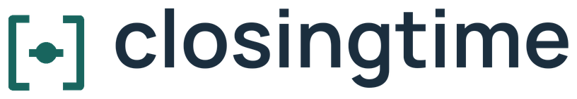
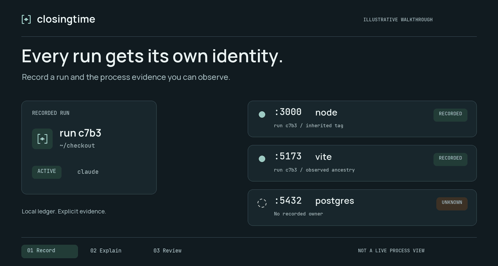

<p align="center">
  <picture>
    <source media="(prefers-color-scheme: dark)" srcset="docs/assets/logo-dark.png">
    
  </picture>
</p>

<p align="center">
  <strong>Know which agent run left that port open.</strong><br>
  <sub>Recorded ownership. Intentional keeps. Cleanup you review.</sub>
</p>

<p align="center">
  <a href="LICENSE"></a>
  <a href="#quick-start"></a>
  <a href="docs/guide.md"></a>
  <a href="docs/validation.md"></a>
</p>

<p align="center">
  <a href="#quick-start">Quick start</a> ·
  <a href="docs/guide.md">Docs</a> ·
  <a href="#library-and-integrations">Integrations</a> ·
  <a href="TODO.md">Roadmap</a> ·
  <a href="CONTRIBUTING.md">Contribute</a> ·
  <a href="https://github.com/ekinburak/closingtime/issues">Issues</a>
</p>

<p align="center">
  <picture>
    <source media="(prefers-reduced-motion: reduce)" srcset="docs/assets/ownership-static.png">
    
  </picture>
  <br>
  <sub>Illustrative walkthrough, not live process output. <a href="docs/assets/ownership-static.png">View the still image.</a></sub>
</p>

Closingtime is an open-source CLI and Rust library that records process ownership for coding-agent runs, explains what survives, and lets you review cleanup before stopping anything. It runs offline, with no account or telemetry.

> **Prototype status.** The core has been tested locally on macOS and in Linux containers. Real agent workload testing, hosted CI and public binary releases remain pending. See the [validation record](docs/validation.md) for evidence and limitations.

## The agent finished. Its server didn't.

A listening port tells you something is running. Closingtime helps explain **which recorded run owns it**, where that run started, and why the process is—or is not—eligible for cleanup.

- **Separate runs, even in one project.** Each wrapper invocation gets its own ID. Native agent session IDs remain separate optional metadata.
- **Keep the evidence.** Launch registration, inherited session tags and observed ancestry are labelled separately. Recorded ownership survives reparenting.
- **Preserve intentional work.** Keep a recorded process and its known descendant tree.
- **Review what would stop.** Cleanup starts with a preview; uncertain targets stay report-only.
- **Reuse the core.** Embed the Rust library or read the versioned JSON contract without accessing SQLite directly.

Polling does not capture every spawn. Closingtime reports missing or conflicting evidence rather than claiming complete ownership coverage.

## Quick start

From a local source checkout, with Rust and a native C toolchain available:

```sh
git clone https://github.com/ekinburak/closingtime.git
cd closingtime
cargo install --path crates/closingtime-cli --locked
closingtime doctor
```

This prototype builds from a source checkout. Package registry releases and
prebuilt binary downloads remain pending. To build without installing:

```sh
cargo build --release --locked
./target/release/closingtime --help
```

Prebuilt binaries and Homebrew are the next distribution priority. Maintainers
can prepare a native archive and checksum with the [binary packaging guide](docs/distribution.md);
these local artifacts are not public releases.

Wrap the command you normally run:

```sh
closingtime run --label checkout -- claude
# Or:
closingtime run -- codex
```

The child inherits normal terminal input/output and its exit status is preserved. Closingtime prints a run ID. When the command exits, inspect what remains:

```sh
closingtime sessions
closingtime who --port 3000
closingtime scan --session RUN_ID
```

Replace `RUN_ID` with the printed ID. An unknown process stays unknown; a shared directory alone never establishes ownership.

If a recorded server is intentional, preserve its current identity:

```sh
closingtime keep --pid 12345
```

Then review the run:

```sh
closingtime clean --session RUN_ID          # Preview only
closingtime clean --session RUN_ID --apply  # Fresh checks + type yes in a terminal
```

The example PID is illustrative. Select the actual PID from your ownership lookup. Nothing is automatically cleaned up when a run ends.

## Commands

| Command | What it does |
|---|---|
| `run -- <command>` | Start a recorded run, tag the child and observe descendants. |
| `sessions` | List runs, lifecycle state and surviving resources. |
| `scan [--session ID]` | Show recorded resources, ownership evidence and cleanup eligibility. |
| `who --port PORT` / `who --pid PID` | Explain a current listener or process; report unknown ownership honestly. |
| `clean --session ID` | Preview eligible actions without changing ownership or decisions. |
| `clean --session ID --apply` | Refresh the preview, require interactive confirmation and recheck every target. |
| `keep --pid PID` / `unkeep --pid PID` | Preserve or release a recorded identity; ancestor keeps still apply. |
| `doctor` | Report process-identity, metadata, TCP and signal capabilities. |
| `export --json` | Export the versioned local ledger, including action history. |

Read commands support `--json`. `export` always emits JSON. `--state-dir PATH` chooses a dedicated private ledger directory. Read commands with no ledger do not create one.

## Cleanup is a review, not a guess

Attribution alone never authorizes a stop. Every eligible target requires:

1. Recorded ownership and a **confirmed ended run**.
2. A matching current host, boot, UID, PID, kernel start time and executable.
3. Readable, non-conflicting ownership evidence and known unmanaged status.
4. No keep decision or protection rule.
5. Human review in the CLI, followed by another eligibility and identity check before each signal.

Kept descendants, active or unconfirmed runs, other users' processes, invoking ancestors, system processes and manager-owned services are excluded. Zombies are reported as awaiting parent reaping. Missing end events stay unconfirmed.

Cleanup signals **individual verified processes**: SIGTERM, a three-second grace period, then another check before SIGKILL. Linux requires pidfds and has no plain-PID fallback. **macOS has a remaining identity-check/signal race**; it is reduced by immediate rechecking, not eliminated.

Piped or JSON-mode apply is refused. The CLI has no `--yes`, automatic reaper, process-group kill or cgroup kill. Action intent is persisted before signaling, and outcomes remain in the local history.

The 240-case synthetic corpus produced zero incorrectly eligible targets on the tested platforms. That is evidence for those scenarios, **not a universal safety guarantee**. [Coverage and native results →](docs/validation.md)

## Library and integrations

`closingtime-core` exposes the same operations used by the CLI:

```text
begin_session → spawn_owned / register_owned → observe → end_session
                                           → plan_cleanup → apply_plan
```

An embedding harness must provide its own review and approval before applying a plan. `ReviewedApproval` acknowledges that caller decision; it is not an authorization token.

| Integration | Start here |
|---|---|
| Rust harness | [Minimal recording example](crates/closingtime-core/examples/instrument.rs) |
| Python or another tool | [JSON export reader](examples/python_reader.py) |
| Stable interface | [`closingtime.session.v1` contract](docs/session-v1.md) |

The library and CLI are available from this workspace; neither is claimed to be published to crates.io. Portlist/Herdr integrations, hooks and MCP remain [future work](TODO.md).

## Local by default

Sessions, observations, keeps and action results live in a private SQLite ledger. Closingtime makes no network calls and does not store full command arguments, prompts, transcripts or arbitrary environment variables.

| Platform | Default state directory |
|---|---|
| Linux | `$XDG_STATE_HOME/closingtime`, or `~/.local/state/closingtime` |
| macOS | `~/Library/Application Support/closingtime` |

Stored metadata includes project/executable paths and process identities. Tags and local registration express cooperative provenance; they are not an adversarial security boundary. See the [usage and safety guide](docs/guide.md) for permissions, terminal signals, keep inheritance and recording limits.

## Development

```sh
cargo fmt --all --check
cargo clippy --workspace --all-targets --locked -- -D warnings
cargo test --workspace --locked
python3 tests/terminal_smoke.py --binary target/debug/closingtime
```

The suite covers model safety decisions, concurrent ledger writes, actual detached TCP listeners, SIGTERM escalation, terminal behavior and lookup latency with 200 live recorded processes. The [GitHub Actions checks](https://github.com/ekinburak/closingtime/actions/workflows/ci.yml) run on Linux and macOS; see the [validation record](docs/validation.md) for the evidence behind published results.

See the [contribution guide](CONTRIBUTING.md) for setup, verification and scope. The [README artwork source](docs/assets/README.md) includes the wordmarks, motion assets and regeneration command.

## Documentation and community

| Looking for | Start here |
|---|---|
| Everyday use and cleanup behavior | [Usage and safety guide](docs/guide.md) |
| Embedding in a Rust harness | [Recording example](crates/closingtime-core/examples/instrument.rs) |
| Reading data from another language | [Python example](examples/python_reader.py) · [JSON contract](docs/session-v1.md) |
| Test evidence and remaining limitations | [Validation record](docs/validation.md) |
| Supported scope and upcoming work | [Requirements](PRD.md) · [Roadmap](TODO.md) |
| Bugs, questions and feature proposals | [GitHub Issues](https://github.com/ekinburak/closingtime/issues) |
| Contributing a change | [Contribution guide](CONTRIBUTING.md) |

## Project direction

Ownership explanations, keep controls, cleanup safety and local history belong in the complete free core. A possible future team service is a hypothesis, not a current offering. There is no paid tier or pricing commitment.

- [Implementation scope](PRD.md)
- [Deferred work and release gates](TODO.md)
- [Local validation](docs/validation.md)

The original discovery research is outside this source distribution; its market estimates are not product claims.

## License

[Apache-2.0](LICENSE).
